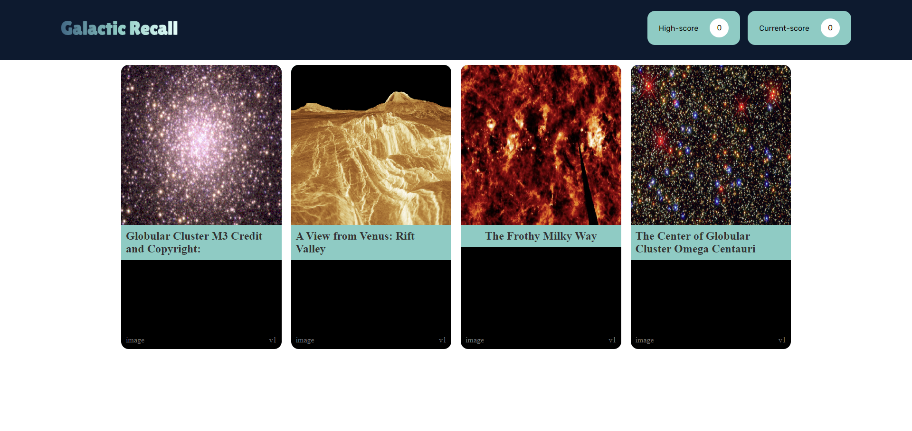

# Galactic Recall

Welcome to Galactic Recall, an exciting space-themed memory game that combines fun with learning about the cosmos!

## Overview

Galactic Recall fetches captivating space images from the NASA API, creating an engaging card-matching game. Test your memory by clicking on cards to reveal stunning images and titles. But beware - clicking the same card twice will cost you the game!

## Play Now!

Experience the game: [Galactic Recall](https://galactic-recall.vercel.app/)

## Features

- **Educational and Fun:** Learn about space while enjoying a captivating memory game.
- **Responsive Design:** Play seamlessly on all modern devices.
- **Challenging Gameplay:** Test your memory skills by avoiding duplicate clicks.

## How to Play

1. **Choose Your Difficulty:**

   - Select from three difficulty levels: Easy, Medium, or Hard.
   - Each level increases the challenge by adding more cards.

2. **Memory Challenge:**

   - Click on the cards to reveal space images and titles.
   - Memorize the cards to avoid clicking the same card twice.

3. **Scoring:**

   - Challenge yourself to achieve the highest score.
   - Every correct match earns points, but beware of penalties for repeated clicks.

4. **Enjoy the Learning Journey:**
   - Immerse yourself in the beauty of space while playing a fun memory game.

## Screenshots

### Home Page

### Game Page

## Getting Started

## Credits

- NASA API: Fetching stunning space images.
- [Vercel](https://vercel.com/): Hosting the Galactic Recall app.
